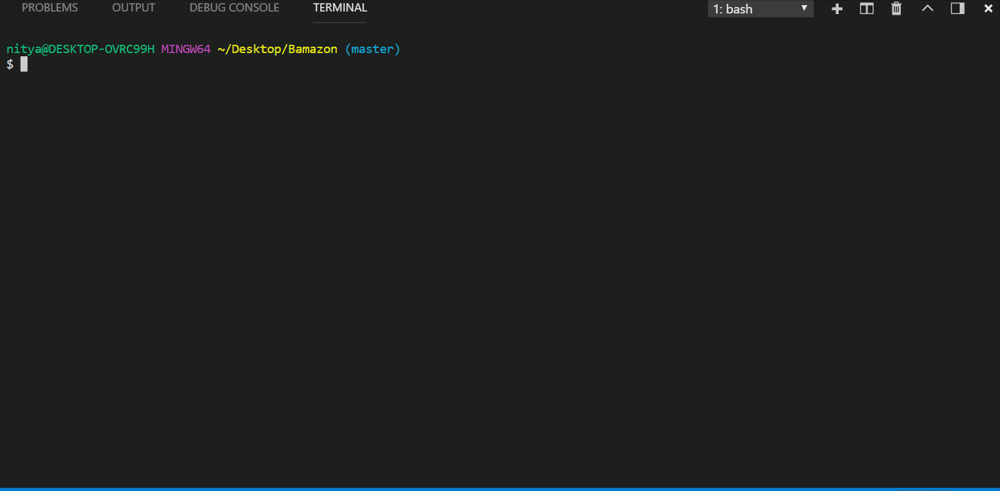

<h1>Bamazon</h1>

Amazon-like storefront CLI-Application with the MySQL and Node JS

The app will take in orders from customers and deplete stock from the store's inventory. 

<h4>Customer View</h4>

The products table contains each of the following columns:

<ul>
<li>item_id (unique id for each product)</li>
<li>product_name (Name of product)</li>
<li>department_name</li>
<li>price (cost to customer)</li>
<li>stock_quantity (how much of the product is available in stores)</li>
</ul>
<h4> App Functionality</h4>

- Running this application will first display all of the items available for sale. Includes the ids, names, and prices of products for sale.

- The app should then prompt users with two messages:

<ul><li>The first should ask them the ID of the product they would like to buy.</li>
<li>The second message should ask how many units of the product they would like to buy.</li></ul>

Once the customer has placed the order, the application should check if your store has enough of the product to meet the customer's request.

If not, the app should log a phrase like Insufficient quantity!, and then prevent the order from going through.

However, if the store does have enough of the product, app should fulfill the customer's order.

<ul><li>This means updating the SQL database to reflect the remaining quantity.</li>
<li>Once the update goes through, show the customer the total cost of their purchase.</li></ul>
<h4>Author</h4>

Nitya Kandukuri
