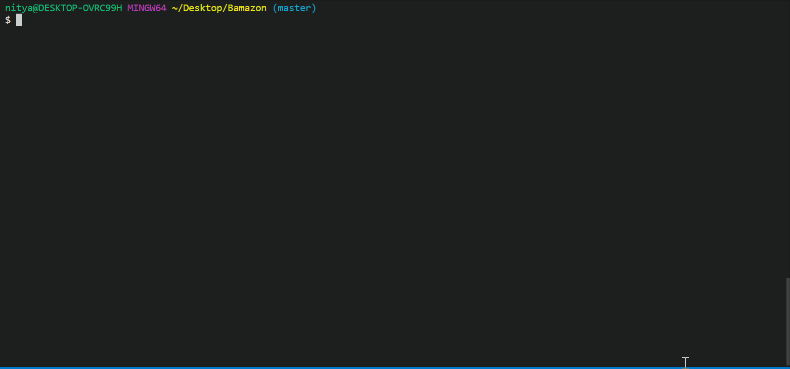

<h1>Bamazon</h1>
<h5>Amazon-like storefront CLI-Application with Node JS and MySQL</h5>

MySQL setup

- The products table contains each of the following columns:

<ul>
<li>item_id (unique id for each product)</li>
<li>product_name (Name of product)</li>
<li>department_name</li>
<li>price (cost to customer)</li>
<li>stock_quantity (how much of the product is available in stores)</li>
</ul>

NPM Modules setup

<ul>
<li>mysql</li>
<li>inquirer</li>
<li>table</li>
<li>console table</li>
</ul>

There are two views of the Bamazon app

<ul>
<li>Customer View</li>
<li>Manager View</li>
</ul>

<h4>Customer View</h4>

<h4>Customer View - App Functionality</h4>

The app will take in orders from customers and deplete stock from the store's inventory. 

- Running this application will first display all of the items available for sale. Includes the ids, names, and prices of products for sale.

- The app should then prompt customers with two messages:

<ul><li>The first prompt should ask for the ID of the product they would like to buy.</li>
<li>The second prompt should ask how many units of the product they would like to buy.</li></ul>

Once the customer has placed the order, the application should check if the store has enough of the product to meet the customer's request.

If not, the app should log a phrase like Insufficient quantity!, and then prevent the order from going through by repeating the questions again

However, if the store does have enough of the product, app should fulfill the customer's order.

<ul><li>This means updating the SQL database to reflect the remaining quantity.</li>
<li>Once the update goes through, the total cost of their purchase is displayed.</li></ul>
<h4>Manager View</h4>

<h4>Manager View - App Functionality</h4>

 Running this application will:

<ul>List a set of menu options:
<li>View Products for Sale</li>
<li>View Low Inventory</li>
<li>Add to Inventory</li>
<li>Add New Product</li>
<li>Exit</li></ul>

If a manager selects "View Products for Sale", the app should list every available item: the item IDs, names, prices, and quantities.

If a manager selects "View Low Inventory", then it should list all items with an inventory count lower than five.

If a manager selects "Add to Inventory", your app should display a prompt that will let the manager "add more" of any item currently in the store.

If a manager selects "Add New Product", it should allow the manager to add a completely new product to the store.

If a manager selects "Exit",it should exit the app

<h4>Author</h4>

Nitya Kandukuri
